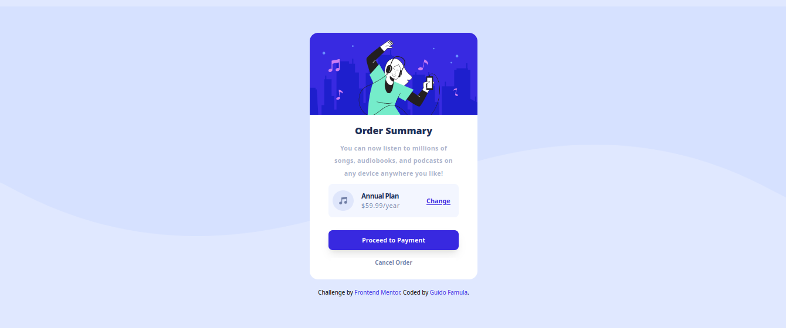
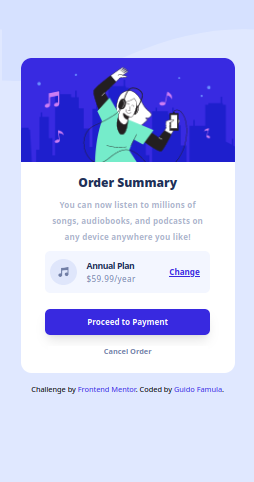

<h1 align="center">Order Summary Component</h1>

</img>

   Challenge by  <a href="https://www.frontendmentor.io?ref=challenge" target="_blank">frontendmentor.io</a>. Coded by <a href="https://guidofamula.com">Guido Famula</a>.

  <h3>
    <a href="https://www.frontendmentor.io/solutions/order-summary-component-oThH3-g4cJ" target='_blank' color="white">
      Solution URL
    </a>
   ~||~     <a target='_blank' href="https://guidofamula.github.io/order-summary-component-frontendmentor/">
      Live URL
    </a>
   ~||~     <a target='_blank' href="https://www.frontendmentor.io/challenges/order-summary-component-QlPmajDUj">
      Challenge URL
    </a>
  </h3>

 
 

## Table of contents

- [Overview](#overview)
  - [The challenge](#the-challenge)
  - [Mobile Version](#mobile-version)
- [My process](#my-process)
  - [Built with](#built-with)
  - [What I learned](#what-i-learned)
  - [Useful resources](#useful-resources)
- [Author](#author)
- [Acknowledgments](#acknowledgments)

## Overview

### The challenge

Users should be able to:

- See hover states for interactive elements

### Mobile Version

</img>

## My process

### Built with

- Semantic HTML5 markup
- CSS custom properties
- Flexbox
- CSS Grid
- Mobile-first workflow
- [Tailwind CSS](https://tailwindcss.com/) - For styles

### What I learned

This project taught me to get used to writing css code without having the design of figma, XD etc., so it trained my feelings on the formulation of css components, sizes, animation hovering and what elements fit the rules of this challenge image, some things like flex and grid continue to be honed along with projects from frontend mentors.

### Useful resources

- [Tailwind Cheatsheet](https://tailwindcomponents.com/cheatsheet/) - This is an amazing reference which helped me guiding the design. I'd recommend it to anyone still learning this reference, like choosing pixel, setup grid, flex etc.

## Author

- My Website - [GUIDOFAMULA.COM](https://guidofamula.com)
- Frontend Mentor - [@guidofamula](https://www.frontendmentor.io/profile/guidofamula)
- Linkedin - [Guido Famula](https://www.linkedin.com/in/guido-famula/)

## Acknowledgments

Thank you to all my friends or frontend mentor friends who often give me advice and guidance, so that I am more motivated and focused on living my activities as a frontend developer.
